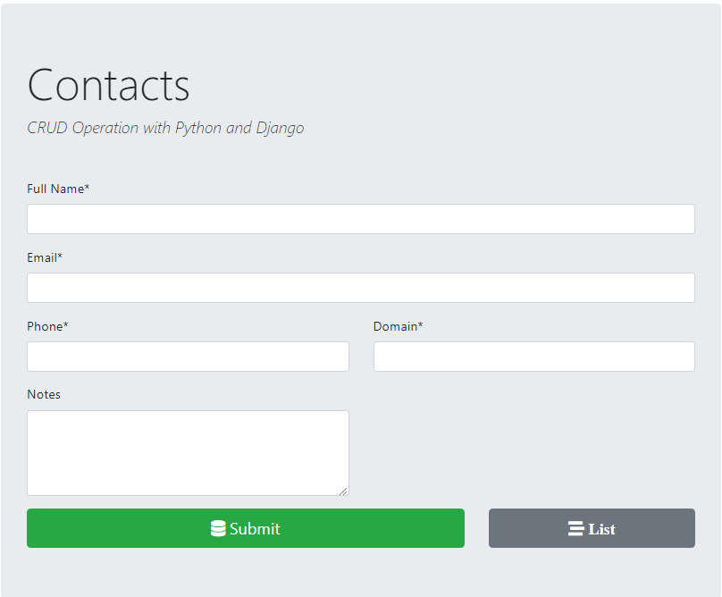
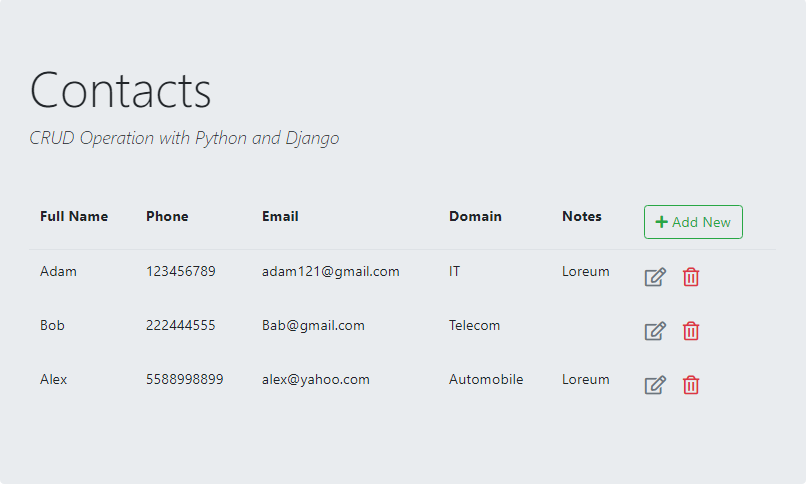

Simple CRUD Operation in Django
===

Download the packages in requirement.txt

**For DataBase:**
Create a Database PostgreSQL or MySQL

Add database credential to settings.py under whois/whois/

**run the following command in cdm:**

python manage.py migrate

python manage.py runserver

**In Browser go to**

http://127.0.0.1:8000/contact/		To view form Page	

http://127.0.0.1:8000/contact/list/  	To view list Page	
